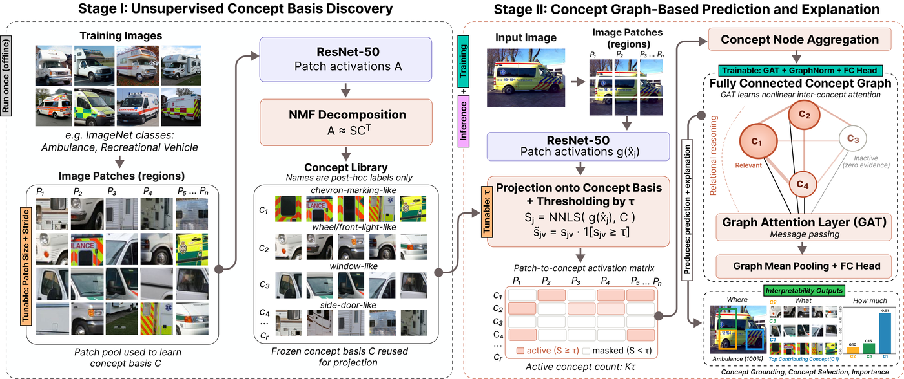

# G-CBM: Graph-based Concept Bottleneck Models

Official code for **[Beyond Heatmaps: Unsupervised Concept-Graph Reasoning for Interpretable Visual Explanation](https://arxiv.org/abs/2607.01416)**  
(IJCAI-ECAI 2026 Workshop on Explainable Artificial Intelligence).

**Links:** [Paper (arXiv)](https://arxiv.org/abs/2607.01416) · [PDF (arXiv)](https://arxiv.org/pdf/2607.01416) · [PDF (this repo)](paper/G_CBM_IJCAI_ECAI_26.pdf)

G-CBM discovers visual concepts with unsupervised NMF (via CRAFT), builds a per-image concept graph with a tunable filtering threshold τ, and classifies with a Graph Attention Network (GAT). Predictions come with concept selection, spatial grounding, and importance scores. Across ImageNet, HAM10000, PH2, and Derm7pt, G-CBM improves average AUC by **3.7% relative** over a ResNet-50 CNN baseline.



## Key results

Test-set AUC / F1 (mean ± std over 3 seeds). G-CBM uses the per-dataset calibrated τ. DenseNet-201 / MobileNet-V2 rows are in the [paper](https://arxiv.org/abs/2607.01416).


| Model               | HAM10000                        | PH2                             | Derm7pt                 | ImageNet                |
| ------------------- | ------------------------------- | ------------------------------- | ----------------------- | ----------------------- |
| CNN ResNet-50       | 0.891±.011 / 0.865±.019         | 0.903±.096 / 0.901±.085         | 0.828±.029 / 0.791±.014 | 0.980±.004 / 0.923±.006 |
| **G-CBM ResNet-50** | **0.923±.004** / **0.909±.015** | **0.960±.006** / **0.925±.004** | 0.868±.008 / 0.823±.019 | 0.983±.002 / 0.935±.003 |


Cells report **AUC / F1**. Bold = best among CNN and G-CBM for that dataset/metric.

### Classifier ablations (why GAT helps)

Replacing the GAT with an MLP or linear head on the same concept bottleneck (single-node graphs) yields consistently lower AUC/F1. Inter-concept attention therefore contributes predictive accuracy, not only structure for explanations.


| Model                 | HAM10000                        | PH2                             | Derm7pt                         | ImageNet                        |
| --------------------- | ------------------------------- | ------------------------------- | ------------------------------- | ------------------------------- |
| G-CBM ResNet-50 (GAT) | **0.923±.004** / **0.909±.015** | **0.960±.006** / **0.925±.004** | **0.868±.008** / **0.823±.019** | **0.983±.002** / **0.935±.003** |
| MLP-CBM ResNet-50     | 0.856±.002 / 0.799±.006         | 0.897±.006 / 0.854±.000         | 0.810±.008 / 0.762±.005         | 0.977±.000 / 0.925±.000         |
| Linear-CBM ResNet-50  | 0.850±.000 / 0.768±.001         | 0.887±.059 / 0.866±.020         | 0.810±.001 / 0.724±.009         | 0.971±.002 / 0.910±.004         |


### Concept selectivity (ResNet-50)

Mild filtering often improves F1 while using fewer active concept nodes. On PH2, AUC reaches **0.960** with only **2 of 10** concepts; on HAM10000, peak F1 **0.909** uses **3.8 of 9** nodes at τ = 0.2.


| Dataset  | r   | τ   | F1 (τ=0)   | F1 (τ)     | AUC (τ)    | Avg. active concepts |
| -------- | --- | --- | ---------- | ---------- | ---------- | -------------------- |
| HAM10000 | 9   | 0.2 | 0.885±.005 | 0.909±.015 | 0.923±.004 | 3.8                  |
| PH2      | 10  | 0.5 | 0.887±.002 | 0.925±.004 | 0.960±.006 | 2.0                  |
| Derm7pt  | 12  | 0.1 | 0.806±.019 | 0.823±.019 | 0.868±.008 | 9.0                  |
| ImageNet | 8   | 0.1 | 0.944±.006 | 0.935±.003 | 0.983±.002 | 6.4                  |


## Installation

Python 3.10+ recommended. A virtual environment is recommended:

```bash
python -m venv .venv
source .venv/bin/activate   # Windows: .venv\Scripts\activate
pip install -r requirements.txt
pip install -e .
```

Notes:

- `dgl==2.4.0+cu118` expects a CUDA 11.8 wheel; install a matching [DGL](https://www.dgl.ai/pages/start.html) build for your platform if needed.
- `pip install -e .` installs the `gcbm` package from `src/gcbm` (editable). Run CLIs from `src/` after that (see below).


## Datasets

### Demo (shipped): MAVREC Car vs Van

A small **licence-aligned** binary subset (**Car** = 0, **Van** = 1) is included under [`datasets/mavrec_car_van/`](datasets/mavrec_car_van/) (~1104 cropped JPEGs + CSVs). You can run the Quickstart without downloading anything else.

Crops are adapted from [MAVREC](https://mavrec.github.io/) (Dutta, Das, Nielsen, Chakraborty, Shah; CVPR 2024), **CC BY 4.0** — full attribution and BibTeX in [NOTICE](NOTICE). To **regenerate** the subset from a full MAVREC download, see [`scripts/README.md`](scripts/README.md) and [`scripts/generate_mavrec_vehicle_crops.py`](scripts/generate_mavrec_vehicle_crops.py).

### Paper datasets (not shipped)

The paper also reports **HAM10000**, **PH2**, **Derm7pt**, and an **ImageNet** binary subset (Ambulance vs Recreational Vehicle). Those images are **not** in this repository (non-commercial / research-only upstream terms). See [Licence](#licence) and [NOTICE](NOTICE).

Download (optional, for paper reproduction):

- PH2: [Kaggle](https://www.kaggle.com/datasets/spacesurfer/ph2-dataset)
- Derm7pt: [SFU](https://derm.cs.sfu.ca/Welcome.html)
- HAM10000: [Harvard Dataverse](https://dataverse.harvard.edu/dataset.xhtml?persistentId=doi:10.7910/DVN/DBW86T)
- ImageNet subset: `wget https://image-net.org/data/winter21_whole/<wnid>.tar` (use `n02701002` for ambulance, `n04065272` for recreational vehicle)

### Layout

**Demo (already in the repo):**

```
datasets/mavrec_car_van/
  images/{car,van}/*.jpg
  train.csv validation.csv test.csv nmf.csv all.csv
  class_names.txt
```

**Paper datasets** (if you download them): place **images** under `data/` and **CSV splits** under `datasets/`:

```
data/
  PH2Dataset/trainx/          # PH2 images
  ham10000/                   # HAM10000 images
  derm7pt/images/             # Derm7pt images
  imagenet/                   # ImageNet subset (wnid folders or flat layout matching CSVs)

datasets/
  ham10000/{train_balanced,validation,test,all_balanced}.csv
  ph2dataset/PH2_{train_balanced,validation,test,all_balanced}.csv
  derm7pt/derm7pt_{train_balanced,validation,test,all_balanced}.csv
  imagenet/{train,val,test,nmf}.csv
```

CSV format: image path (relative to that dataset’s `images_root`) and integer label. Edit paths in [src/gcbm/config.py](src/gcbm/config.py) only if your layout differs.

Artefacts after training (always under the **repository root**, even when CLIs are run from `src/`):

```
concept_graph_data/<dataset>/
  craft/<dataset>/craft_<dataset>.dill
  graphs/<dataset>/concept_graphs_{train,validation,test}.dgl
  models/<dataset>/<dataset>_best_model.ckpt

results/   # local eval outputs; shipped CSVs: classification_main.csv, selectivity_resnet50.csv
```


## Quickstart (MAVREC Car vs Van demo)

Install deps, then run CLIs from `src/` (demo images/CSVs are already under `datasets/mavrec_car_van/`):

```bash
cd src

# 1) Concepts + graphs at τ = 0
python build_concept_graphs.py \
  --dataset mavrec_car_van \
  --steps gen_concepts build_graphs \
  --auto-n-components \
  --candidates 6 7 8 9 10 12 16 \
  --patch-size 70 --stride-r 0.5 \
  --sim-threshold 0.0 \
  --output-root concept_graph_data

# 2) Train G-CBM
python train_gcbm.py \
  --dataset mavrec_car_van \
  --output-root concept_graph_data \
  --epochs 300

# 3) Explain one image (after training)
python explain.py \
  --dataset mavrec_car_van \
  --image_path ../datasets/mavrec_car_van/images/car/<some_file>.jpg \
  --output-root concept_graph_data \
  --backbone resnet50 \
  --patch-size 70 --stride-r 0.5 \
```

Relative paths such as `concept_graph_data` resolve against the **repository root** (not `src/`).

For the full paper protocol (validation τ calibration and retrain), see **Pipeline** below.

## Pipeline

Published protocol (run from `src/` after `pip install -e .`):

1. Discover concepts and build graphs at **τ = 0**
2. Train G-CBM once on those graphs
3. Sweep τ on the **validation** split; pick **τ** by validation F1 / AUC
4. Rebuild graphs at **τ** and **retrain** G-CBM
5. Evaluate, plot, and explain using the τ model

```bash
cd src   # if not already there
```

### 1. Concept discovery and graphs (τ = 0)

```bash
python build_concept_graphs.py \
  --dataset mavrec_car_van \
  --steps gen_concepts build_graphs \
  --auto-n-components \
  --candidates 6 7 8 9 10 12 16 \
  --patch-size 70 --stride-r 0.5 \
  --sim-threshold 0.0 \
  --output-root concept_graph_data
```

`--auto-n-components` selects the number of concepts and writes `concept_search.json` under the CRAFT directory.

### 2. Train G-CBM at τ = 0

```bash
python train_gcbm.py \
  --dataset mavrec_car_van \
  --output-root concept_graph_data \
  --epochs 300
```


### 3. Calibrate τ on validation

Sweep τ through the τ = 0 checkpoint (graphs rebuilt in memory; no retraining yet):

```bash
python eval_threshold_sweep.py \
  --run-root concept_graph_data \
  --datasets mavrec_car_van \
  --split val
python plot_threshold_sweep.py --run-root concept_graph_data
```

Choose τ by best validation F1 / AUC (dataset- and backbone-specific).

### 4. Rebuild graphs at τ and retrain

```bash
python build_concept_graphs.py \
  --dataset mavrec_car_van \
  --steps build_graphs \
  --craft-path concept_graph_data/mavrec_car_van/craft/mavrec_car_van/craft_mavrec_car_van.dill \
  --patch-size 70 --stride-r 0.5 \
  --sim-threshold 0.2 \
  --output-root concept_graph_data

python train_gcbm.py \
  --dataset mavrec_car_van \
  --output-root concept_graph_data \
  --epochs 300
```

Replace `0.2` with your calibrated τ. Use this retrained checkpoint for evaluation and explanation.

### 5. CNN baselines

```bash
python train_cnn.py --dataset mavrec_car_van --backbone resnet50 --output-root concept_graph_data
```

Optional: for domain-specific CRAFT, first train the CNN baseline, then pass the
saved `{dataset}_{backbone}_cnn.pt` into concept discovery / graphs / τ-sweep /
explain via `--backbone-weights`. When unset, ImageNet weights are
used (existing pipelines unchanged). Fitting CRAFT with weights writes
`craft/*/backbone_weights.json` so later steps can reuse the same encoder
without repeating the flag.


### 6. MLP-CBM / Linear-CBM ablations

Build single-node concept-bottleneck graphs at the same τ, then train:

```bash
python build_concept_graphs.py \
  --dataset mavrec_car_van \
  --steps build_graphs \
  --concept-bottleneck-mlp-linear \
  --sim-threshold 0.2 \
  --output-root concept_graph_data

python train_mlp_cbm.py --dataset mavrec_car_van --output-root concept_graph_data
python train_linear_cbm.py --dataset mavrec_car_van --output-root concept_graph_data
```


### 7. Concept discovery quality

Compares NMF, PCA, and K-Means on an ImageFolder directory:

```bash
python eval_concept_quality.py \
  --img_folder_dir /path/to/images \
  --num_concepts 25 \
  --patch_size 70 --stride_r 0.5
```


### 8. Faithfulness

```bash
python eval_fidelity.py --run-root concept_graph_data
python plot_fidelity.py --run-root concept_graph_data
```


### 9. Concept explanations

Writes two PNGs under the **repository root**:

- `output_concept_explanation.png` — localisation, importance bars, exemplars
- `output_active_patches.png` — most active patches per top concept

```bash
python explain.py \
  --dataset mavrec_car_van \
  --image_path ../datasets/mavrec_car_van/images/car/<some_file>.jpg \
  --output-root concept_graph_data \
  --backbone resnet50 \
  --patch-size 70 --stride-r 0.5 \
  --true-class 0
```


## Repository layout

```
src/gcbm/                         Installable package (pip install -e .)
  config.py / utils.py            Dataset registry and helpers
  concepts.py                     Backbone split, NMF / CRAFT fitting
  gcbm_graph.py / gcbm_model.py   G-CBM graph builder and GAT classifier
  cbm_graph.py                    Concept-bottleneck graphs (MLP / Linear)
  mlp_cbm_model.py / linear_cbm_model.py

src/                              CLI entry points (cd src; python …)
  build_concept_graphs.py         Concept discovery + graph build
  train_gcbm.py                   Train / evaluate G-CBM
  train_cnn.py                    CNN baselines
  train_mlp_cbm.py / train_linear_cbm.py
  eval_concept_quality.py         NMF vs PCA vs K-Means comparison
  eval_threshold_sweep.py         F1 / AUC vs τ on a frozen checkpoint
  eval_fidelity.py                Deletion / insertion faithfulness
  plot_threshold_sweep.py
  plot_fidelity.py
  explain.py                      Concept localisation + active-patch figures

scripts/                          Optional MAVREC crop regenerator + docs
datasets/mavrec_car_van/          Shipped CC BY 4.0 demo (images + CSVs)
pyproject.toml                    Package metadata for editable install
paper/                            Paper PDF (G_CBM_IJCAI_ECAI_26.pdf)
concept_graph_data/               CRAFT artefacts + checkpoints (repo root)
results/                          Evaluation outputs (repo root)
assets/                           Figures (pipeline.png)
data/ / datasets/                 Optional paper-dataset images / CSVs (not shipped)
```


## Citation

```bibtex
@misc{hossain2026heatmapsunsupervisedconceptgraphreasoning,
      title={Beyond Heatmaps: Unsupervised Concept-Graph Reasoning for Interpretable Visual Explanation},
      author={Md Mohasin Hossain and Anar Amirli and Robert Leist and Md Abdul Kadir and Daniel Sonntag},
      year={2026},
      eprint={2607.01416},
      archivePrefix={arXiv},
      primaryClass={cs.CV},
      url={https://arxiv.org/abs/2607.01416},
}
```

## Licence

This project's **source code** is licensed under the **Apache License 2.0** — see [LICENSE](LICENSE) and [NOTICE](NOTICE).

Third-party dependency inventory (CycloneDX SBOM) is under [sbom/](sbom/).

**Datasets are not covered by Apache-2.0.** The shipped demo under [`datasets/mavrec_car_van/`](datasets/mavrec_car_van/) is an adapted MAVREC subset under **CC BY 4.0** (creators: Dutta et al., CVPR 2024; full attribution + BibTeX in [NOTICE](NOTICE)). Paper datasets (HAM10000, PH2, Derm7pt, ImageNet) remain non-commercial / research-only upstream terms and are **not** redistributed here.

